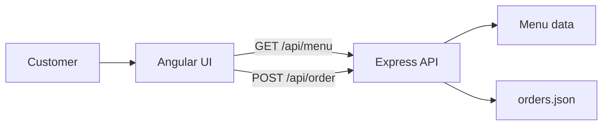

# QuickBite Angular Restaurant App

QuickBite is a responsive full-stack restaurant ordering application built with Angular 18 and an Express REST API. Customers can browse a menu, review individual dishes, manage a cart, complete checkout, and submit an order through a validated API.

## Highlights

- Responsive black-and-gold restaurant interface
- Angular routing for Home, Menu, Details, Cart, and Checkout
- Menu and item-detail data loaded from an Express API
- Quantity selection and centralized cart state
- Calculated order totals and checkout validation
- Server-side payload validation and total verification
- JSON-backed order persistence for local demonstration
- Same-origin production deployment with Angular history fallback
- GitHub Actions build and API smoke tests

## Architecture



Angular owns the browser experience and cart state. Express exposes the REST endpoints, validates submitted orders, recalculates totals, and stores accepted orders. In production, Express also serves the compiled Angular application.

## REST API

| Method | Endpoint | Purpose |
| --- | --- | --- |
| `GET` | `/api/health` | Deployment health check |
| `GET` | `/api/menu` | Return all menu items |
| `GET` | `/api/menu/:id` | Return one menu item |
| `POST` | `/api/order` | Validate and save an order |

An order requires a customer name, valid email, at least one item, positive integer quantities, and a total that matches the server-calculated amount.

## Run locally

Requirements: Node.js 20+ and npm.

```bash
npm ci
```

Start the API:

```bash
npm run server
```

In a second terminal, start Angular:

```bash
npm start
```

Open `http://localhost:4200`. Angular proxies `/api` requests to Express on port `3000`.

## Production build

```bash
npm run build
npm run start:production
```

The Express server uses the host's `PORT` environment variable and serves the compiled application from `dist/quickbite-angular18`.

## Project structure

```text
src/app/                 Angular components, pages, routing, and services
src/assets/images/       Version-controlled menu artwork
server.js                Express REST API and production static hosting
orders.json              Local demonstration order storage
proxy.conf.json          Local Angular-to-Express API proxy
render.yaml              Render deployment blueprint
.github/workflows/       Automated build and smoke testing
```

## Engineering notes

`orders.json` is intentionally lightweight for a portfolio demonstration. A production version should use PostgreSQL or another durable database because container filesystems can be replaced during deployment.

## License

MIT © 2026 Godwill Afolabi
